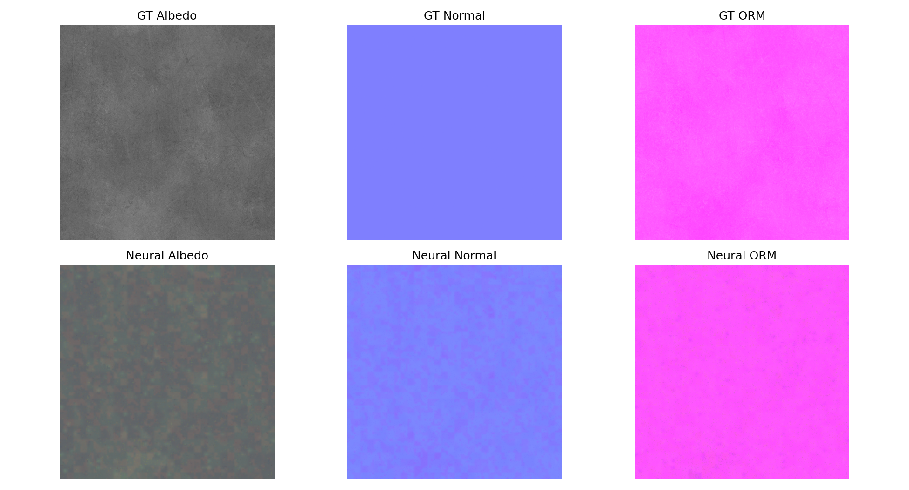
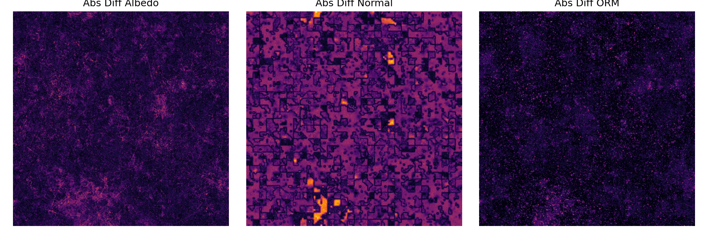
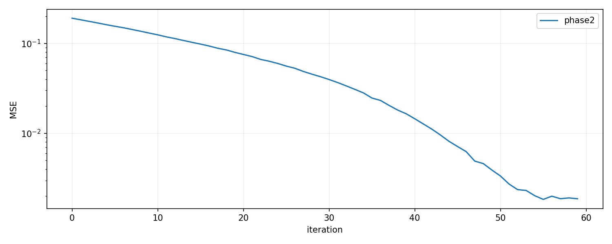
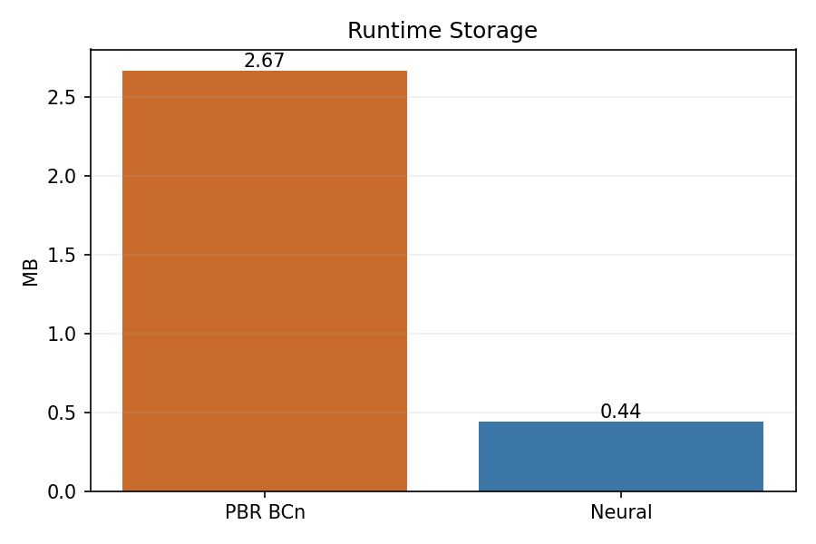

# Real-Time Neural Materials using Block-Compressed Features

This project implements the paper: Real-Time Neural Materials using Block-Compressed Features
https://arxiv.org/pdf/2311.16121

This is a WIP project.

This repo trains a neural material decoder that reconstructs:
- albedo RGB
- normal XY
- AO roughness metallic

Target output channels are 8 total:
- `[albedo_r, albedo_g, albedo_b, normal_x, normal_y, ao, roughness, metallic]`

The main orchestrator is:
- `infrerenfe_nural_mateirals.py`

Core building blocks:
- `neuralmaterials.py`
- `prepare_freepbr_material.py`
- `export_true_bc6_dds.py`
- `shaders/neural_material_decode.hlsl`

## Demo (Results from `iter60_demo`)

### Ground Truth vs. Neural Reconstruction


### Error Heatmap (Difference)


### Training Loss


### Cost Savings


## TODO
- [ ] Export surrogates into direct BC6 format instead of intermediate bc6params.pt and blocks12.bin, these are just for debugging
- [ ] use latent.pt decoded float vectors only for png debugging generation
- [ ] modify the dds exporter to use the params to directly write to BC6dds block
- [ ] Finish the vulkan application to show how to infer using HLSL shaders
 
## Pipeline Summary

1. Prepare a material dataset from FreePBR into `reference_8ch.pt`.
2. Train neural latents + decoder (`warmup -> BC constrained`).
3. Export artifacts:
   - decoder weights (`decoder_fp16.bin`)
   - latent mip tensors (`latent_XX_mip_YY.pt`)
   - debug previews (`latent_XX_mip_YY.png`)
   - custom packed records (`*.blocks128.bin`)
4. Optionally export true GPU BC6 DDS textures (`export_true_bc6_dds.py`):
   - now uses latent `.pt` mips directly
   - builds one mip-chained DDS per latent
   - BC6-encodes that DDS via external CLI
5. Runtime shader samples BC6 latent textures + runs MLP decode.

## Setup

```bash
cd /Users/phanisrikar/Desktop/Projects/NN-PBR
python3 -m venv .venv
source .venv/bin/activate
pip install --upgrade pip
pip install torch numpy pillow matplotlib
```

## Recommended Usage

### 1) Prepare Dataset

```bash
source .venv/bin/activate
python prepare_freepbr_material.py \
  --product-url https://freepbr.com/product/scratched-up-steel/ \
  --variant-keyword "-bl.zip" \
  --size 1024 \
  --out-root data/freepbr/materials
```

Output folder:
- `data/freepbr/materials/<material-name>/reference_8ch.pt`
- `data/freepbr/materials/<material-name>/dataset_report.json`
- `data/freepbr/materials/<material-name>/maps/*`

### 2) Train Only

```bash
source .venv/bin/activate
python infrerenfe_nural_mateirals.py \
  --mode train \
  --reference-pt data/freepbr/materials/scratched-up-steel-bl/reference_8ch.pt \
  --output-dir runs/train_long \
  --device auto \
  --phase1-iters 5000 \
  --phase2-iters 200000 \
  --phase3-iters 0 \
  --batch-size 4096 \
  --log-every 200
```

### 3) Full Run (train + plots + inference maps)

```bash
source .venv/bin/activate
python infrerenfe_nural_mateirals.py \
  --mode full \
  --reference-pt data/freepbr/materials/scratched-up-steel-bl/reference_8ch.pt \
  --output-dir runs/full_demo \
  --device auto \
  --phase1-iters 30 \
  --phase2-iters 60 \
  --phase3-iters 0 \
  --batch-size 1024 \
  --log-every 10 \
  --interactive-progress \
  --analysis-batch-size 131072
```

Full mode analysis now includes:
- `analysis/gt_vs_neural.png` (GT vs inferred outputs)
- `analysis/gt_vs_neural_diff.png` (absolute error heatmaps)
- `analysis/quality_metrics.json` (full-image and random-batch metrics)

### 4) Infer Only from Exported Artifacts

```bash
source .venv/bin/activate
python infrerenfe_nural_mateirals.py \
  --mode infer \
  --export-dir runs/train_long/export \
  --output-dir runs/infer_only \
  --device auto
```

### 5) Export True BC6 DDS (GPU-ready)

Requires external BC encoder CLI (for example Compressonator CLI in `PATH`).

```bash
source .venv/bin/activate
python export_true_bc6_dds.py \
  --export-dir runs/train_long/export \
  --decode-smoke
```

## Artifact Formats and Why They Exist

- `*.blocks128.bin`
  - Custom compact block records from training surrogate parameters.
  - Not guaranteed to be BC6 DDS bitstream compliant.
  - Used for surrogate payload accounting.

- `latent_XX_mip_YY.pt`
  - Float latent mips decoded from learned surrogate block params.
  - Canonical source for true BC6 export in this repo.

- `latent_XX_mip_YY.png`
  - LDR debug preview only.
  - Generated from latent tensor values mapped from `[-1,1]` to `[0,255]`.
  - Not used as BC6 source anymore.

- `latent_XX.bc6.dds`
  - True BC6 DDS output for runtime loading by GPU API.
  - Produced via external encoder from mip-chained float DDS source.

## Runtime Inputs

From export directory:
- `decoder_fp16.bin`
- `metadata.json` (contains `lod_biases`, model dims)
- true BC6 DDS latent textures from `export_true_bc6_dds.py`

Shader:
- `shaders/neural_material_decode.hlsl`

Runtime outputs:
- `albedo`
- `normalTS`
- `ao`
- `roughness`
- `metallic`

## CLI Reference

### `prepare_freepbr_material.py`

- `--product-url` (required, str): FreePBR product URL.
- `--variant-keyword` (optional, str, default `-bl.zip`): preferred zip variant filter.
- `--size` (optional, int, default `1024`): resize maps to square size, `<=0` keeps source size.
- `--material-name` (optional, str, default `None`): output folder name override.
- `--out-root` (optional, Path, default `data/freepbr/materials`): dataset root.

### `infrerenfe_nural_mateirals.py`

- `--mode` (optional, enum, default `full`): `train|full|infer`.
- `--reference-pt` (Path, required for `train` and `full`): reference tensor file.
- `--output-dir` (Path, required for `train` and `full`; optional for `infer`): output root.
- `--export-dir` (Path, required for `infer`; optional for `train` and `full`): existing export path.
- `--device` (optional, str, default `auto`): compute device.
- `--out-channels` (optional, int, default `8`): expected material output channels.
- `--ref-mips` (optional, int, default `9`): reference mip levels.
- `--latent-res` (optional, csv str, default `512,256,128,64`): latent base resolutions.
- `--latent-mips` (optional, csv str, default `8,7,6,5`): mip count per latent.
- `--hidden-dim` (optional, int, default `16`): MLP hidden width.
- `--endpoint-bits` (optional, int, default `6`): surrogate endpoint quant bits.
- `--index-bits` (optional, int, default `3`): surrogate index quant bits.
- `--batch-size` (optional, int, default `4096`): train batch size.
- `--phase1-iters` (optional, int, default `5000`): warmup phase iterations.
- `--phase2-iters` (optional, int, default `200000`): BC-constrained phase iterations.
- `--phase3-iters` (optional, int, default `0`): quantized finetune iterations.
- `--log-every` (optional, int, default `200`): training log interval.
- `--interactive-progress` (flag, default `False`): live phase progress bars with current loss.
- `--infer-chunk` (optional, int, default `65536`): inference chunk size.
- `--infer-size` (optional, str, default `auto`): `auto` or explicit size like `1024` or `1024x1024`.
- `--analysis-batch-size` (optional, int, default `131072`): extra random UV/LOD evaluation batch in full mode.
- `--export-true-bc6` (flag, default `False`): run true BC6 DDS export after main mode flow.
- `--bc6-cli` (optional, str, default `None`): explicit BC encoder executable name/path.
- `--bc6-format` (optional, str, default `None`): encoder format override.

### `export_true_bc6_dds.py`

- `--export-dir` (required, Path): export root containing `metadata.json` and latent `.pt` mips.
- `--out-dir` (optional, Path, default `<export-dir>/true_bc6_dds`): BC6 DDS output folder.
- `--bc6-cli` (optional, str, default `None`): explicit encoder executable.
- `--bc6-format` (optional, str, default inferred from metadata): BC6 format override.
- `--latent-index` (optional, int, default `None`): filter to one latent.
- `--mip-index` (optional, int, default `None`): export subset mips only.
- `--max-latents` (optional, int, default `0`): cap number of latent textures to export.
- `--decode-smoke` (flag, default `False`): decode first BC6 DDS to PNG sanity output.
- `--keep-source-dds` (flag, default `False`): keep intermediate `RGBA16F` source DDS files.

## Storage/Savings Note

Savings comparisons in `infrerenfe_nural_mateirals.py` are based on:
- analytical runtime BCn baseline (`BC1 albedo + BC5 normal + BC1 ORM`, mip chain included)
- neural runtime payload (`*.blocks128.bin` + `decoder_fp16.bin`)

They are not based on original PNG file sizes.

## License 
MIT.
