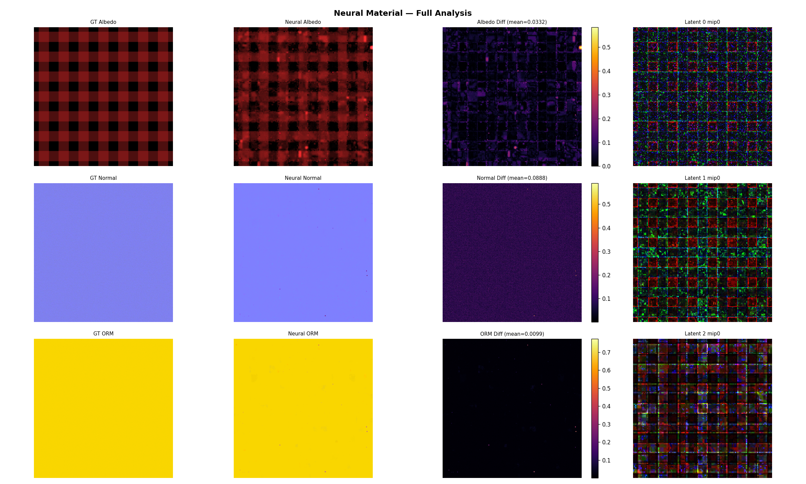
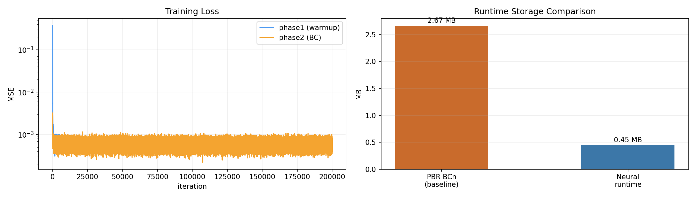

# Real-Time Neural Materials using Block-Compressed Features

This project implements the paper: Real-Time Neural Materials using Block-Compressed Features
https://arxiv.org/pdf/2311.16121

> WIP implementation.

It "bakes" a single material into:
- a few latent texture pyramids (BC6-filterable at runtime), and
- a tiny MLP decoder (`decoder_fp16.bin`) evaluated in a shader to reconstruct 8 PBR channels.

Output channels: `[albedo_r, albedo_g, albedo_b, normal_x, normal_y, ao, roughness, metallic]`

---

## Demo

Phase1: 5k | Phase2: 200k iterations on AMD RX9070 GPU

Full analysis dashboard (GT | Neural | Diff | Latent preview):



Training loss + storage comparison:



Still facing some issues with full 5k phase 1 and 200k training on a RX9070 GPU afte full training, looks like need to check singned/unsigned BC6H modes

---

## Pipeline Summary

1. Prepare a material dataset from FreePBR → `reference_8ch.pt`
2. Train neural latents + decoder (warmup → BC-constrained phases)
3. Export artifacts (flat in `<run>/export/`):
   - `decoder_fp16.bin` — quantized MLP weights (FP16)
   - `decoder_state.pt` — full-precision decoder state
   - `latent_XX_mip_YY.pt` — float latent mip tensors
   - `latent_XX_mip_YY.png` — LDR debug previews (mapped from `[-1,1]` to `[0,255]`)
   - `metadata.json` — model dims, latent inventory, lod biases
4. Export BC6 DDS textures (`export_true_bc6_dds.py`) — the active cleanup target is spec-correct BC6H Mode 10 packing:
   - builds one mip-chained DDS per latent (`latent_XX.bc6.dds`)
   - see `BC6_MODE10_TODO.md` for the paper-aligned export checklist
5. Runtime shader samples BC6 latent textures + runs FP16 MLP decode

---

## Setup

```bash
python3 -m venv .venv
source .venv/bin/activate
pip install --upgrade pip
pip install torch numpy pillow matplotlib
```

---

## Usage

### 1) Prepare Dataset

```bash
source .venv/bin/activate
python prepare_freepbr_material.py \
  --product-url https://freepbr.com/product/scratched-up-steel/ \
  --variant-keyword "-bl.zip" \
  --size 1024 \
  --out-root data/freepbr/materials
```

Outputs:
- `data/freepbr/materials/<material>/reference_8ch.pt`
- `data/freepbr/materials/<material>/dataset_report.json`
- `data/freepbr/materials/<material>/maps/`

### 2) Full Run (train + plots + inference)

Quick smoke check (120 iters):
```bash
source .venv/bin/activate
python infrerenfe_nural_mateirals.py \
  --mode full \
  --reference-pt data/freepbr/materials/scratched-up-steel-bl/reference_8ch.pt \
  --output-dir runs/full_demo \
  --device auto \
  --phase1-iters 20 \
  --phase2-iters 100 \
  --phase3-iters 0 \
  --batch-size 2048 \
  --log-every 10 \
  --interactive-progress \
  --analysis-batch-size 65536
```

Full training run:
```bash
source .venv/bin/activate
python infrerenfe_nural_mateirals.py \
  --mode train \
  --reference-pt data/freepbr/materials/scratched-up-steel-bl/reference_8ch.pt \
  --output-dir runs/train_long \
  --device auto \
  --phase1-iters 5000 \
  --phase2-iters 200000 \
  --batch-size 4096 \
  --log-every 200
```

Full-mode outputs (in `runs/<name>/`):
- `inference/pbr_preview.png` — albedo / normal / ORM panel
- `analysis/all_analysis.png` — GT | Neural | Diff | Latent preview (3×4 grid)
- `analysis/training_loss.png` — loss curves + storage bar
- `analysis/quality_metrics.json`
- `export/` — flat latent `.pt`, `.png`, `decoder_fp16.bin`, `metadata.json`

### 3) Train Only

```bash
source .venv/bin/activate
python infrerenfe_nural_mateirals.py \
  --mode train \
  --reference-pt data/freepbr/materials/scratched-up-steel-bl/reference_8ch.pt \
  --output-dir runs/train_long \
  --device auto \
  --phase1-iters 5000 \
  --phase2-iters 200000 \
  --batch-size 4096 \
  --log-every 200
```

### 4) Infer from Exported Artifacts

```bash
source .venv/bin/activate
python infrerenfe_nural_mateirals.py \
  --mode infer \
  --export-dir runs/train_long/export \
  --output-dir runs/infer_only \
  --device auto
```

### 5) Export BC6 DDS (Mode 10 cleanup in progress)

```bash
source .venv/bin/activate
python export_true_bc6_dds.py \
  --export-dir runs/train_long/export
```

With explicit output dir:
```bash
python export_true_bc6_dds.py \
  --export-dir runs/train_long/export \
  --out-dir runs/train_long/export/true_bc6_dds
```

Skip verification diffing (faster):
```bash
python export_true_bc6_dds.py \
  --export-dir runs/train_long/export \
  --no-verify
```

Outputs (in `<export-dir>/true_bc6_dds/`):
- `latent_XX.bc6.dds` — BC6H DDS with full mip chain (DXGI_FORMAT_BC6H_UF16)
- `true_bc6_export_report.json` — per-mip PSNR metrics
- `latent_XX_mip_YY.diff.png` — diff figures (unless `--no-verify`)

Implementation note: the canonical target is paper-aligned BC6H Mode 10 export with 6-bit endpoints, 3-bit indices, and FP16 decoder weights. Track the remaining cleanup in `BC6_MODE10_TODO.md`.

Typical quality: mip0 PSNR 39–45 dB on real latent textures; >60 dB on small mips.

---

## Artifact Formats

| File | Description |
|------|-------------|
| `metadata.json` | Model dims, latent inventory, lod biases (version 2 = flat export layout) |
| `decoder_fp16.bin` | FP16 decoder weights for shader use |
| `decoder_state.pt` | Full-precision PyTorch decoder state dict |
| `latent_XX_mip_YY.pt` | Float latent mip tensor — canonical source for BC6 export |
| `latent_XX_mip_YY.png` | LDR debug preview (mapped from `[-1,1]` to `[0,255]`) |
| `latent_XX.bc6.dds` | BC6H DDS runtime artifact (Mode 10 cleanup target) |

---

## Runtime

From `export/`:
- `metadata.json`
- `decoder_fp16.bin`
- `latent_XX.bc6.dds` (runtime BC6 DDS per latent)

Shader: `shaders/neural_material_decode.hlsl`

Runtime reconstructs: albedo · normalTS · ao · roughness · metallic

---

## Quick Start

For full usage guide (with all CLI flags and examples), use the skill:
```bash
/nnpbr-usage
```

---

## Storage Comparison Note

`infrerenfe_nural_mateirals.py` compares:
- **Baseline BCn**: analytical runtime memory (`BC1 albedo + BC5 normal + BC1 ORM`, full mip chain)
- **Neural runtime**: `latent_XX_mip_YY.pt` tensors + `decoder_fp16.bin`

Comparisons reflect runtime memory, not source PNG file sizes.

---

## License

MIT.
